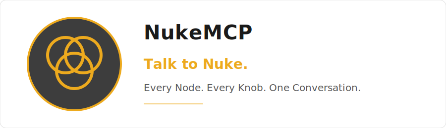

<p align="center">
  
</p>

<p align="center">
  <a href="https://github.com/kleer001/nuke-mcp/blob/main/LICENSE"></a>
  <a href="https://www.python.org/"></a>
  <a href="https://modelcontextprotocol.io/"></a>
  <a href="https://www.foundry.com/products/nuke-family/nuke"></a>
  <a href="https://github.com/kleer001/nuke-mcp/commits/main"></a>
  <a href="https://github.com/kleer001/nuke-mcp/issues"></a>
  <a href="https://github.com/kleer001/nuke-mcp/network/members"></a>
  <a href="https://github.com/kleer001/nuke-mcp/watchers"></a>
  <a href="https://github.com/kleer001/nuke-mcp/stargazers"></a>
</p>

NukeMCP connects AI assistants (Claude, ChatGPT, local LLMs) to a running Nuke session via the [Model Context Protocol](https://modelcontextprotocol.io). Describe what you want in plain English, and the AI creates, connects, and configures nodes in your comp.

## Status

**Production-ready.** Verified end-to-end against Nuke 17.0v1. Full test suite with CI, lint, and coverage. See the [roadmap](docs/ROADMAP.md) for what's next.

## Get Started

**Prerequisites:** git and Python 3.10+. Nuke is optional at setup time — Nuke 15+ supported, 17+ recommended.

**Linux / macOS:**
```bash
curl -sSL https://raw.githubusercontent.com/kleer001/nuke-mcp/main/scripts/bootstrap.sh | bash
```

**Windows (PowerShell):**
```powershell
powershell -c "irm https://raw.githubusercontent.com/kleer001/nuke-mcp/main/scripts/bootstrap.bat -OutFile bootstrap.bat; .\bootstrap.bat"
```

The bootstrap clones the repo, installs [uv](https://docs.astral.sh/uv/), creates a venv, installs deps, and prints next steps for the Nuke addon and MCP client.

<details>
<summary><strong>Manual setup (step by step)</strong></summary>

#### 1. Clone and install

```bash
git clone https://github.com/kleer001/nuke-mcp.git
cd nuke-mcp
uv sync
```

#### 2. Install the Nuke Addon

Copy the addon into your Nuke scripts directory:

```bash
cp nuke_addon/nuke_mcp_addon.py ~/.nuke/
```

Or add the `nuke_addon/` directory to your `NUKE_PATH`.

Launch Nuke — in the Script Editor, run:

```python
import nuke_mcp_addon
nuke_mcp_addon.start()
```

A **NukeMCP** panel appears with Start/Stop button and log. The server listens on port 54321.

#### 3. Configure Your MCP Client

**Claude Code:** The included `.mcp.json` configures the server automatically. Run Claude Code from the project root.

**Claude Desktop:** Go to **File > Settings > Developer > Edit Config** and add:

```json
{
  "mcpServers": {
    "nuke-mcp": {
      "command": "uv",
      "args": ["--directory", "/path/to/nuke-mcp", "run", "nuke-mcp"]
    }
  }
}
```

**Other MCP clients (ChatGPT, local LLMs):** Any client that supports stdio transport works. Use the same command/args pattern above, or wrap the server in an HTTP bridge for remote clients.

</details>

## Headless Mode

NukeMCP can auto-discover and launch Nuke without a GUI:

```bash
# Auto-discover Nuke, launch headless, connect
uv run nuke-mcp --headless

# Specify a Nuke executable
uv run nuke-mcp --headless --nuke-path /usr/local/Nuke17.0v1/Nuke17.0

# Just find Nuke installations and check licensing
uv run nuke-mcp --discover
```

Discovery searches standard paths (`/usr/local/Nuke*`, `/Applications/Nuke*`), `.desktop` files, running processes, mounted volumes, and the `NUKE_EXE` environment variable. It also detects Foundry trial licenses (JWT tokens) and RLM license servers.

## Available Tools

Core tools available on all Nuke variants, plus gated tools for NukeX and Nuke 17+. Destructive tools require user confirmation — enforced at the code level, not just in the AI's instructions.

<details>
<summary>Full tool list</summary>

### Core (all variants)

| Tool | Description | Annotations |
|---|---|---|
| `get_script_info` | Script name, frame range, FPS, colorspace, node count | readOnly |
| `get_node_info` | Node class, position, inputs, knob values | readOnly |
| `create_node` | Create a node with optional name, knobs, position | |
| `modify_node` | Set knob values on an existing node | idempotent |
| `delete_node` | Delete a node (requires confirmation) | destructive |
| `connect_nodes` | Connect output of one node to input of another | |
| `position_node` | Set node position in the graph | idempotent |
| `auto_layout` | Auto-arrange nodes | |
| `execute_python` | Run arbitrary Python in Nuke (requires confirmation) | destructive |
| `load_script` | Open a .nk file (requires confirmation) | destructive |
| `save_script` | Save the current script (requires confirmation) | destructive |
| `set_project_settings` | Set FPS, colorspace, resolution | idempotent |
| `set_frame_range` | Set first/last frame | idempotent |

### Comp & Rendering

| Tool | Description |
|---|---|
| `render_frames` | Render a Write node over a frame range |
| `set_proxy_mode` | Toggle proxy mode |
| `find_nodes_by_type` | Find all nodes of a given class |
| `find_broken_reads` | Find Read nodes with missing files |
| `batch_set_knob` | Set a knob value on multiple nodes |
| `batch_reconnect` | Reconnect multiple nodes to a new input |

### Templates & LiveGroups

| Tool | Description |
|---|---|
| `list_toolsets` | List saved toolsets |
| `load_toolset` | Load a toolset |
| `save_toolset` | Save selected nodes as a toolset |
| `create_live_group` | Create a LiveGroup from nodes |

### NukeX (gated)

| Tool | Description |
|---|---|
| `create_tracker` | Create a Tracker4 node |
| `solve_tracker` | Execute tracking |
| `setup_stabilize` | Set tracker to stabilize mode |
| `create_camera_tracker` | Create a CameraTracker node |
| `create_3d_scene` | Create a Scene node |
| `setup_camera` | Create a Camera3 node |
| `setup_scanline_render` | ScanlineRender with scene + camera |
| `setup_projection` | Camera projection workflow |
| `setup_deep_pipeline` | Deep compositing pipeline |
| `setup_deep_merge` | Deep merge |
| `convert_to_deep` | Flat to deep conversion |
| `setup_copycat` | CopyCat ML training node |
| `train_copycat` | Train a CopyCat model |

### Nuke 17+ (gated)

| Tool | Description |
|---|---|
| `import_splat` | Gaussian splat reader |
| `setup_splat_render` | Splat render with camera |
| `setup_bigcat` | BigCat ML training (NukeX + 17+) |
| `create_annotation` | Create annotation/sticky note |
| `list_annotations` | List all annotations |

### Memory & Events

| Tool | Description |
|---|---|
| `read_memory` | Read persistent memory files |
| `write_memory` | Write persistent memory |
| `log_correction` | Log a compositor correction |
| `list_memory` | List all memory files |
| `update_project_memory` | Snapshot current script settings |
| `subscribe_events` | Subscribe to real-time scene events |
| `get_events` | Get recent events |
| `clear_events` | Clear event log |
| `search_nuke_docs` | BM25 search over Nuke docs |

</details>

## Architecture

```
AI Client (Claude, etc.)
    │ stdio (JSON-RPC)
    ▼
MCP Server (src/nukemcp/)
    │ TCP socket (JSON)
    ▼
Nuke Addon (nuke_addon/)
    │ executeInMainThread (GUI) / queue dispatch (headless)
    ▼
Nuke's Python Environment
```

Three layers, each with a clear job:

1. **Nuke Addon** — runs inside Nuke, executes commands thread-safely, pushes real-time events via Nuke callbacks. Supports both GUI mode (executeInMainThread) and headless mode (queue-based dispatch).
2. **MCP Server** — FastMCP 2.14.x, tool annotations, version gating, mock mode for offline dev, auto-discovery, headless launch, plugin system, persistent memory.
3. **AI Guidance** — `CLAUDE.md` defines behavior rules: naming conventions, confirmation requirements, graph organization, memory usage.

## Bidirectional Events

The addon pushes real-time scene change events to the MCP server when subscribed:

- `node_created` / `node_deleted` — track graph changes
- `knob_changed` — parameter modifications
- `script_loaded` / `script_saved` — file operations

Subscribe via `subscribe_events()`, retrieve with `get_events()`.

## Memory System

NukeMCP maintains persistent memory across sessions:

- **`memory/facility.md`** — studio conventions (colorspace, naming, paths, preferred tools)
- **`memory/project/`** — auto-populated script snapshots
- **`memory/corrections.md`** — logged corrections from the compositor

Memory is exposed as MCP Resources (`nuke://memory/facility`, `nuke://memory/corrections`) for automatic context at session start.

## Plugin System

Extend NukeMCP without forking — drop Python files into `plugins/`:

```python
# plugins/my_studio_tools.py
def register(server):
    mcp = server.mcp
    conn = server.connection

    @mcp.tool()
    def my_custom_tool(node_name: str) -> dict:
        """Studio-specific tool."""
        return conn.send_command("get_node_info", {"node_name": node_name})
```

See `plugins/README.md` for details.

## Offline Development

Run the server against a mock Nuke socket — no Nuke installation required:

```bash
uv run nuke-mcp --mock                           # Default: NukeX 17.0v1
uv run nuke-mcp --mock --mock-variant Nuke        # Plain Nuke (no NukeX tools)
uv run nuke-mcp --mock --mock-version 15.0v1      # Older version
```

The mock maintains internal state (nodes, connections, settings) so sequential commands produce coherent responses.

## Version Gating

The addon reports its Nuke version and variant on connection. Tools that require NukeX or a minimum Nuke version are gated — they simply don't appear if the connected Nuke doesn't support them.

| Variant | Available |
|---|---|
| Nuke | Core tools (graph, script, comp, render, batch, templates) |
| NukeX | + Tracking, 3D, Deep, CopyCat |
| Nuke 17+ | + Gaussian Splats, BigCat, Annotations |

## Contributing

See [CONTRIBUTING.md](CONTRIBUTING.md) for how to add tools, write tests, and follow the codebase patterns.

## Skills

Skills are multi-step workflow guides that define how Claude should approach
complex, repeatable production tasks using NukeMCP. Unlike single tool calls,
skills orchestrate sequences of MCP tools, filesystem queries, and user
confirmation gates to complete high-level operations safely.

Skills live in the [`skills/`](skills/) folder. Invoke one by describing the task
to Claude — it will recognise the workflow and follow the skill's phases.

| Skill | Description |
|---|---|
| [`retarget-fx-shot`](skills/retarget-fx-shot.md) | Duplicate an FX rig network and remap all file references from one shot's sequences to another's |

---

## Best Practices

See [BEST_PRACTICES.md](docs/BEST_PRACTICES.md) for a compositor-focused guide to using NukeMCP effectively.

## Acknowledgments

This project builds on the work of several open-source contributors:

- **[dughogan/nuke_mcp](https://github.com/dughogan/nuke_mcp)** — the right architecture and the right spirit. Clean, compositor-readable code with a clear socket-based design. Doug Hogan's [fxphd course](https://www.fxphd.com/details/707/) made the concept accessible to the compositing community.
- **[flowagent-sh/nuke-mcp](https://github.com/flowagent-sh/nuke-mcp)** — demonstrated that the feature set can be production-grade, with camera tracking, deep compositing, and ML integration.
- **[kleer001/houdini-mcp](https://github.com/kleer001/houdini-mcp)** — the persistent memory system, CLAUDE.md behavioral rules, BM25-based RAG, bidirectional events, and the proof that a DCC MCP can be a serious piece of software engineering.

## License

MIT

---

<sub>NukeMCP is not affiliated with or endorsed by Foundry. Nuke is a trademark of Foundry.</sub>
